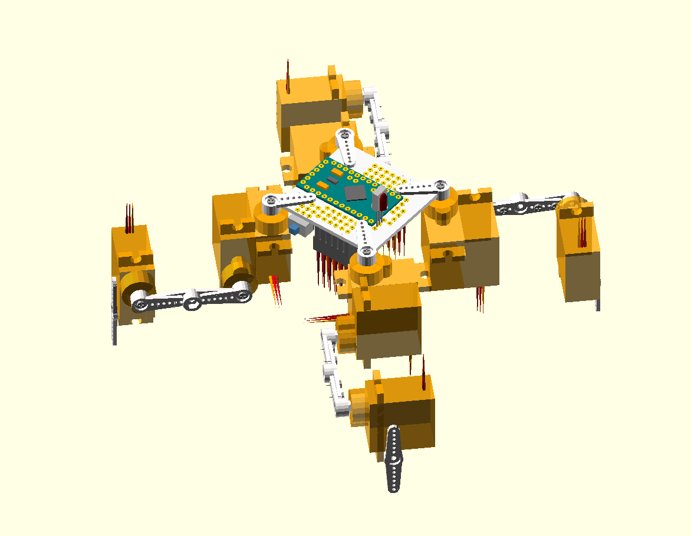

Dice, a Small Spider Quadruped Robot
************************************

This is a small (fits in your palm) walking robot, with three degree of freedom
legs, with Ardunio (Pro Mini) for the brain and controlled by a TV remote. It
is supposed to be very simple, very cheap and very sturdy (but please don't
step on it).

Mechanical construction
=======================

The legs are made from sub-micro RC hobby servos and their horns and screws.
All you need comes with the servos, so no need for any 3D-printed or laser-cut
parts. Optionally you might want to add pieces of rubber at the ends of the
legs, for better traction.

The body is made out of a printed circuit board, and doubles as the robot's
main board. The prototype also uses some pin headers and servo sockets, but
that is all optional -- you can solder everything directly if you want. There
is also an optional power switch (you can unplug the battery instead).

The design files for the legs and the body are all in the repository.

Electronics
===========

Arduino Pro Mini is used for the brains of the robot. It is connected directly
to the servo signals and to the battery. There is also a 1000µF electrolytic
capacitor connected across the battery to avoid brown-outs. An optional voltage
divider of two 47kΩ resistors, with a 47nF capacitor for noise reduction is
used to monitor the battery voltage and shut down the robot when it drops too
low. The battery is any light 1S, 3.7V LiPo cell. Other kinds of batteries can
be used, as long as they are light enough and provide enough power. Remote
control is done using a VS1838B infra-red sensor, but other sensors can be
used.

Several pins of the Arduino are free, including the I²C pins, allowing for
connecting more sensors.

The prototype also has an optional LiPo charging/protection module attached,
for convenience, although the battery can be charged by any suitable charger.

Software
========

All the code is included in this repository. You will need an Arduino IDE and
a TTL2USB programmer for the Pro Mini to compile and upload the software into
the robot. Connect the programmer, open ``dice.ino`` in the Arduino IDE, and
click "Upload". That's all.

For the infra-red communication, I'm using the excellent IRLRemote library,
written by NicoHood.

For controlling the servos, I'm using the Servo library bundled with Arduino.

Control
=======

Since practically every TV remote is different, you have to setup the code to
handle yours. Edit the ``ir.ino`` file and change the protocol, address and
button codes in there to suit your preferences.
