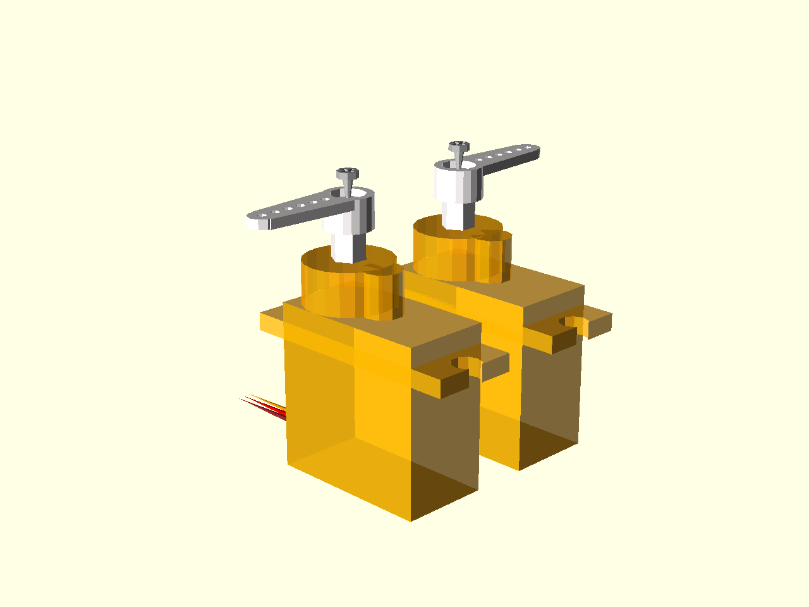
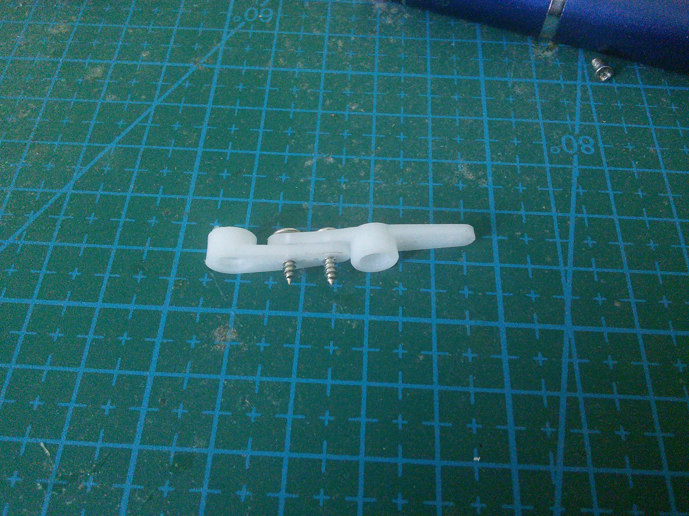
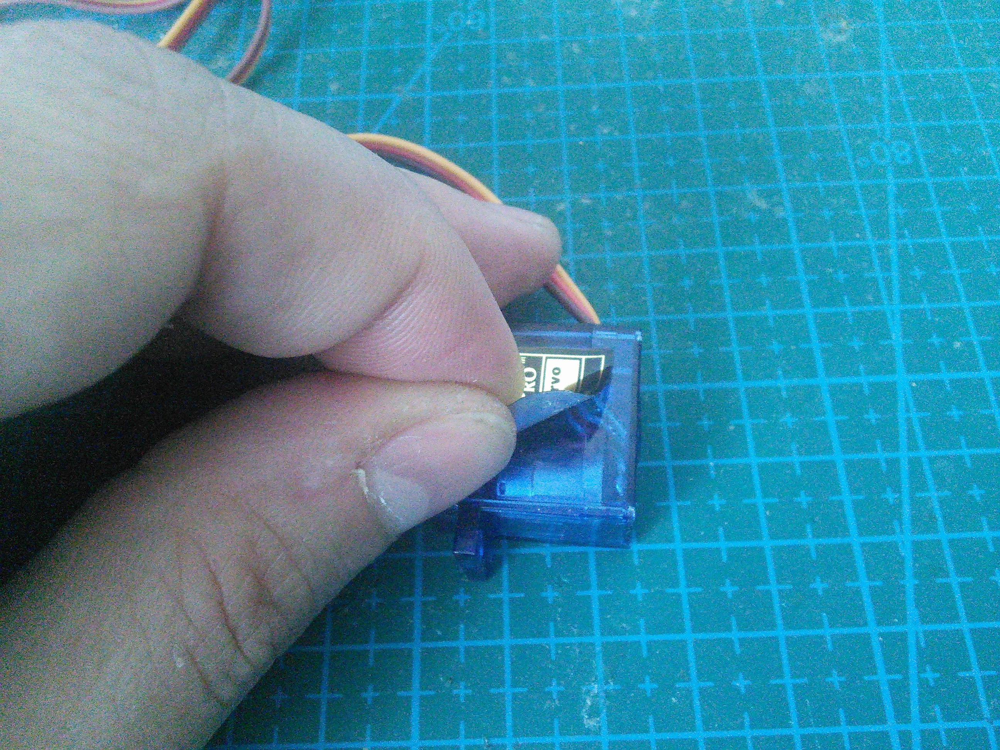
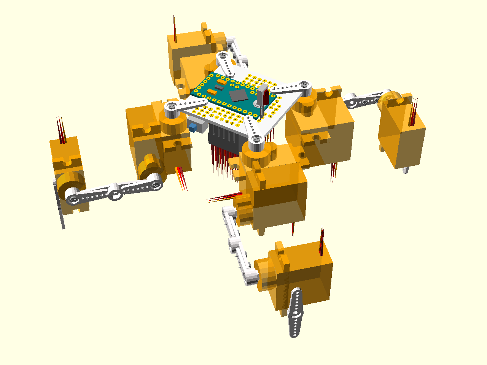

Assembly Instructions
*********************

Electronics
===========

Gather all the electronic components that you will need. At the minimum, you
will need the printed circuit board, the pin headers and the Pro Mini module.
Optionally a 1000µF capacitor, power switch, IR receiver and the battery
monitoring circuit consisting of two 47kΩ resistors and a 47nF capacitor, can
be added. They are all recommended, so we will assume there are there.

There are two ways of assembling the electronic components for Tote. The first
one is compact, like this:

.. image:: scad/assembly01a.png
    :align: center

The second one takes up more space, but lets you remove and replace the Arduino
module. You will need additional female and male pin headers for that:

Throughout the rest of this guide, we will assume the first, compact, version.

All the electronic components need to be soldered onto the printed circuit
board in the right places, as follows:

We will start with the pin headers. First, you have to cut seven pieces, each
of them exactly 6 pins long.

You will also need one header that is 2 pin long, for the battery.

Solder six headers for the servo sockets. Make sure they are straight when you
are soldering the first pin -- it's almost impossible to straighten them later.

And also solder the battery connector in place. You should have one 6-pin
header left. We will need it later.

Now it's time to solder the battery monitoring circuit. First arrange the
elements on the board.

Then carefully solder each one in place.

Finally, solder the remaining header onto the Pro Mini module, so that you can
program it.

Now place the Pro Mini on the PCB, and put a drop of solder into every hole.

To make sure there is a good electric connection, repeat that from the other
side.

Now add the power switch. If you have one with 6 pins, just ignore (or cut off) the remaining 3 pins.

Since we are not using a voltage regulator, we need to short the pads that
would be used for it. Just solder a small piece of wire in there. You can later
remove it if you want to add a voltage regulator.

The 1000µF capacitor has to be soldered with the right polarity. Make sure that
the shorter leg (one one marked on the capacitor with a white stripe) goes to
the hole with a small minus next to it.

Don't solder the capacitor tightly fitting the board -- best leave some wires
from the legs (don't forget to isolate them), so that you can bend it out of
the way when needed. Remember, that you will need to screw in the legs in
there.

Prepare the IR sensor for soldering. Make sure you check the datasheet for your
particular sensor, and bend the legs so that the right ones go into the right
holes. In this case, I need to switch two of the legs, so I simply crossed
them.

Also leave the legs long, so that you can adjust the position of the sensor
later.

That concludes the electronics of our robot.

Programing
==========

In order to program the robot, you need to connect it to your computer. To do
that, you will need an TTL2USB module, and some Dupont cables (you can also use
an FTDI cable, or even another Arduino board). First, connect the cables to
your TTL2USB, make sure to note which color goes with which symbol.

Next, connext the other side of the cables to the Pro Mini header. Make sure
that the connections are as follows:

 * ``TXD`` - ``RXD``
 * ``RXD`` - ``TXD``
 * ``VCC`` - ``VCC`` or ``5V``
 * ``GND`` - ``GND``
 * ``DTR`` - ``DTR``

If your TTL2USB doesn't have a ``DTR`` pin, leave it disconnected. You will
need to manually press the "reset" button on the Pro Mini when programming it,
then.

Now open the ``start/start.ino`` file in the Arduino IDE, from the "Tools →
Board" menu select "Arduino Pro or Pro Mini (3.3V, 8Mhz) w/ ATmega328", connect
the TTL2USB to your computer's USB port, and click the "upload" button. If your
TTL2USB doesn't have a ``DTR`` pin, press the "reset" button on the Pro Mini as
soon as the program size appears in the black console at the bottom of the IDE.
When you see "Upload finished", you can disconnect everything and proceed.

Mechanics
=========

Now it's time to assemble the robot's legs. You will need 12 small servos, with all the screws and the horns that come with them.

.. image:: images/IMG_20150527_145957.jpg
    :align: center

Set all the servos to the zero position (in the middle of their movement
range). Then attach the single-arm horn at 90°. You will need six servos with
the horn in one direction, and six servos with the opposite. Fasten the horns
with the smallest screws (always make sure you un-power the servo before you do
that).

Put the legs together.

.. image:: scad/assembly03.png
    :align: center

First, attach the four servos to the body.

Connect them to the outermost servo sockets. Make sure that the yellow wire is
inside, and the brows wire outside for all the servos.

Screw the bigger screws into the double servo horn . You will need to use some
force, because the holes in the horns are much smaller. Fortunately the plastic
is quite soft.

.. image:: images/IMG_20150528_095744.jpg
    :align: center

Now attach the single horn to that. Repeat for the other side.

If you want, you can cut off the parts of the screws that are sticking out (or
use some smaller screws to begin with).

Remove the stickers from the servos. We will need to apply some glue there, and
the stickers are in the way.

Attach the horns to two servos. You will need two right legs, and two left
ones, that are their mirror images of each other.

.. image:: images/IMG_20150528_101146.jpg
    :align: center

Glue the leg to the servo on the body. I recommend an epoxy glue, but as you
can see, you can even use a two-sided tape. Make sure the alignment is straight.

.. image:: images/IMG_20150528_101501.jpg
    :align: center

Finally, glue a double horn at the end of the leg, as the leg tip. I like to
use the slightly longer horn here (the cross-shaped one), as it is lightly
longer. Note that two-sided tape doesn't work very well here, as the area is
too small for it to stick properly. Use glue.

.. image:: scad/assembly04.png
    :align: center

You can put a piece of rubber (a small rubber hose works best) at the tip of
the leg, to give the robot better traction.

Make sure to attach the right legs in the right orientation, as on the image.

Connect all the servos plugs into their respective sockets. The outermost
socket for every leg is the hip, then knee, then ankle.

Attach the battery on the bottom of the printed circuit board. You can use a
rubber band or a double-sided adhesive tape. When connecting the battery, be
careful to connect the negative wire to the board's mass, and the positive one
to the switch (there is a small plus printed on the board).

Adjustments
===========

You can edit the ``servos.ino`` file to adjust the trims for the servos. Edit
the ``ir.ino`` file to change the TV remote protocol, address and button codes,
to match yours. You can use the example code from the IRLremote library to read
the correct values for your remote. Edit the ``leg.ino`` file to change the
robot dimensions if the parts you used are different from what is described
here.
