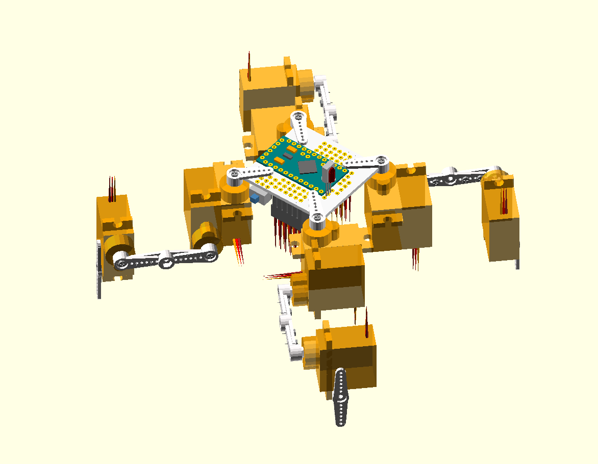

Assembly Instructions
*********************

Step 1
======

.. image:: images/dice-step01.png
    :width: 320px
    :align: center

Solder all the electronic components, except for the capacitor, onto the
printed circuit board. Make sure to make the right connections: the servo plugs
should go with the yellow wire towards inside, and the brown towards outside,
and the IR sensor may have a completely different order of legs than on the
board, you might need to bend the wires a little to get them in the right
order.

.. image:: images/pcb2a.png
    :width: 320px
    :align: center

The power switch, the 1000µF capacitor, the IR and distance sensors, and the
SMD resistors and capacitors on the other side of the board are all optional --
you can just leave them out. If you leave out the power switch, you need to add
a wire in its place, the make the robot always on.

The Arduino board can be soldered directly to the printed circuit board, or you
can use pin headers -- so that you can remove it for programming.

The battery charging module, and any additional modules, can be soldered to
the additional holes on the sides and in the center of the board, and connected
to the right pins with additional wires.

Step 2
======

.. image:: images/dice-step02.png
    :width: 320px
    :align: center

Set all the servos to the zero position (in the middle of their movement
range). Then attach the single-arm horn at 90°. You will need six servos with
the horn in one direction, and six servos with the opposite. Fasten the horns
with the smallest screws (make sure you un-power the servo before you do that).

Step 3
======

.. image:: images/dice-step03.png
    :width: 320px
    :align: center

Put the legs together. You will need two right legs, and two left ones, that
are their mirror images. Use the bigger screws to screw the servo arms
together. Use glue to attach the double-armed horn and to bind the two servos.

Step 4
======

.. image:: images/dice-step04.png
    :width: 320px
    :align: center

Attach the legs to the body, also using the bigger screws. You will need to
make an additional hole in the servo horns. Make sure to attach the right legs
in the right orientation, as on the image.

Step 5
======

Connect all the servos plugs into their respective sockets. The outermost
socket for every leg is the hip, then knee, then ankle. Solder the capacitor,
making sure the negative lead is on the inside of the board. Attach the battery
on the bottom of the printed circuit board. You can use a rubber band or a
double-sided adhesive tape. When connecting the battery, be careful to connect
the negative wire to the board's mass, and the positive one to the switch.

Step 6
======

Connect your TTL2USB programmer and upload the software using Arduino IDE. When
you switch it on, it should start walking.

Step 7
======

You can edit the ``servos.ino`` file to adjust the trims for the servos. Edit
the ``ir.ino`` file to change the TV remote protocol, address and button codes,
to match yours. You can use the example code from the IRLremote library to read
the correct values for your remote.
