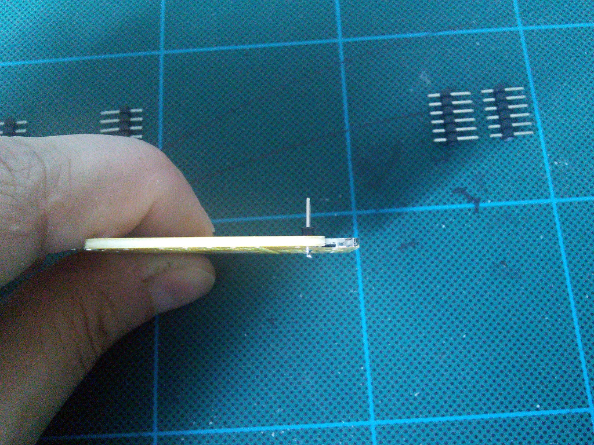

Assembly Instructions for PCB Version 4
***************************************

Decide on the Version
=====================

There are two ways to assemble the board:

You can put everything on top of the board, with the microcontroller board
plugged into a set of female headers like this:

Or you can have the microcontroller board permanently attached on top of the
robot, and most of the components on the bottom side:

The first approach is recommended when you want to experiment with a lot of
different programs and be able to easily swap the microcontrollers, each of
them running different code, or when you want to replace the default Pro Mini
with a different microcontroller.

The second solution is better when you plan on attaching an additional board
to communicate with the Pro Mini and provide higher-level control.

The Servo Headers
=================

Start by soldering the pin headers for connecting the servomechanisms. You will
need six pin male pin headers, with six pins each. You can obtain four of them
headers by breaking in half the pin headers that were added to your Pro Mini
module, however, you will need at least two more.

Insert the first pin header in its place, and solder the first pin, by touching
the soldering iron to the pin and the pad, heating it for a moment, and then
touching the pad with the solder.

After soldering the first pin, always rotate the board and check whether the
pin header is straight. If it's not, melt the solder and align the header
properly. This will be impossible to fix after you solder the rest of the pins,
so remember to always do it.

Repeat that for all six of the headers.

Battery Header and Optional Jumper Headers
==========================================

Prepare two-pin headers for the battery connector and, optionally, jumpers.
There are two optional jumpers you can have on the board, marked A and B.

The A jumper lets you disconnect the microcontroller's power from the rest of
the robot. This is useful if you want to power it separately, or don't want
the servos to use power when you are programming the microcontroller from the
computer.

The B jumper lets you plug between the power switch with the battery monitoring
circuit, and the rest of the robot. Use it if you want to add an additional
voltage regulator or boost converter.

If you want to use the jumpers, remember that you have to cut the traces that
connect them on the underside of the board. The cutting place is marked with
a dashed line:

Note that it may be more convenient to use an angled header for the battery
connector.

.. image:: images/v4/IMG_20150813_174718.jpg
    :align: center

Optional Microcontroller Socket
===============================

If you want the microcontroller board to be pluggable, you will need additional
female headers for making the socket. You will need two 12-pin headers, and two
2-pin ones. You can cut longer headers to make them. Start with the long ones:

And then add the two short ones:

Note, that there are two versions of Pro Mini, differing in where the pins A6
and A7 are located. This board works with both of them, just pick the right
place for one of the short headers.

.. image:: images/v4b/IMG_20150811_103143.jpg
    :align: center

Alternative, Solder the Microcontroller Directly
================================================

Start by soldering the FTDI headers to the Pro Mini board. Shift the plastic
part so that the pins don't protrude on the back of the module -- we want it
to be almost flat.

Add additional pins for the battery and serial connections for your extension
boards:

Now fill the holes in both the board and the module with solder:

Place the module on top of the board, carefully align it, and melt the solder
in each of the holes with your soldering iron, so that they fuse. Make sure you
get proper connections here. It's recommended to check each connection with a
multimeter, and retry if it's bad.

Optional Battery Monitoring Circuit
===================================

Since the battery has higher voltage than the 3.3V our Pro Mini uses, we need
to lower it to be able to measure it, using a voltage divider. This circuit
consists of two 47kΩ resistors and one 47nF capacitor in the upper left corner
of the board:

Place each of the parts in the right spot, and solder one end of it:

When it's in the right position, solder the other end:

Repeat that for each of the parts:

Optional Anti-brownout Capacitor
================================

This capacitor makes sure that the microcontroller has enough current even when
the servos momentarily use all the battery can give. It has its place in the
upper right corner of the board. Pay attention to the markings on the capacitor
and the board, to make sure the negative lead goes into the right hole --
electrolytic capacitors are polarized and connecting them wrong may make them
explode.

The negative lead is usually marked with a dark strip.

Cut off the excess leads from the other side.

Power Switch
============

The power switch goes on the left edge of the board. Pay attention, as there is
a similar set of holes on the other side, but they should be left unpopulated.
You can use them later, when extending your robot.

Optional IR Receiver
====================

If you want to control your robot using a TV remote, you will need to add an
infra-red receiver. Practically any 38kHz module will do, I have tested
TSOP4838, LF0038Q and VS1838B.

The only thing you have to be careful about is to connect the right leads to
the right holes: GND to ground, VCC to 3V3, and OUT to pin 2. To do it, you
will have to cover the leads with isolation and bend them, as they will most
likely be in the wrong order. Check the datasheet of your part for details.

Unlike previous boards, there is no special place to put the sensor. We want
it to be connected to pin 2, which is broken out with all other free pins:

Then just solder it in place:

Optional Piezo Buzzer
=====================

If you want your robot to be able to make sounds, you can add a piezoelectric
speaker on pin 13 -- the same as the build-in LED. Any kind will work fine.
Cut the leads to a convenient length:

Then solder the speaker to the ground and pin 13:

Glue the speaker under the board.

Servo Horns
===========

Insert the single-armed horns that you got with the servos into the large holes
in the corners of the board. Depending on the exact model and manufacturer of
the servo, the horns may be too big to fit -- then you have to use a file to
either make the holes a little larger, or the horns a little smaller.

Attach the horns with two screws each:

And then you can attach the leg servo:

Make sure it can rotate freely, without heating the heads of the screws. Use
a file if there is a problem.

Legs
====

Now it's time to assemble the robot's legs. You will need 12 small servos, with all the screws and the horns that come with them.

Set all the servos to the zero position (in the middle of their movement
range). Then attach the single-arm horn at 90°. You will need six servos with
the horn in one direction, and six servos with the opposite. Fasten the horns
with the smallest screws (always make sure you un-power the servo before you do
that).

.. image:: scad/assembly02.png
    :align: center

Put the legs together.

Screw the bigger screws into the double servo horn . You will need to use some
force, because the holes in the horns are much smaller. Fortunately the plastic
is quite soft.

Now attach the single horn to that. Repeat for the other side.

.. image:: images/IMG_20150528_095925.jpg
    :align: center

If you want, you can cut off the parts of the screws that are sticking out (or
use some smaller screws to begin with).

Remove the stickers from the servos. We will need to apply some glue there, and
the stickers are in the way.

.. image:: images/IMG_20150528_101046.jpg
    :align: center

Attach the horns to two servos. You will need two right legs, and two left
ones, that are their mirror images.

Glue the leg to the servo on the body. I recommend an epoxy glue, but as you
can see, you can even use a two-sided tape. Make sure the alignment is straight.

Finally, glue a double horn at the end of the leg, as the leg tip. I like to
use the slightly longer horn here (the cross-shaped one), as it is lightly
longer. Note that two-sided tape doesn't work very well here, as the area is
too small for it to stick properly. Use glue.

You can put a piece of rubber (a small rubber hose works best) at the tip of
the leg, to give the robot better traction.

Connect all the servos plugs into their respective sockets. The outermost
socket for every leg is the hip, then knee, then ankle. Make sure the yellow
wire is on the inside, and the brown one on the outside.

If you want, you can tie the cables together to make the robot look better and
to avoid tangling. Make sure you leave enough loose cables for the legs to move
freely.

