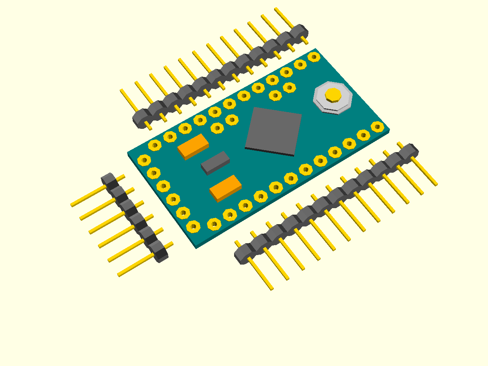
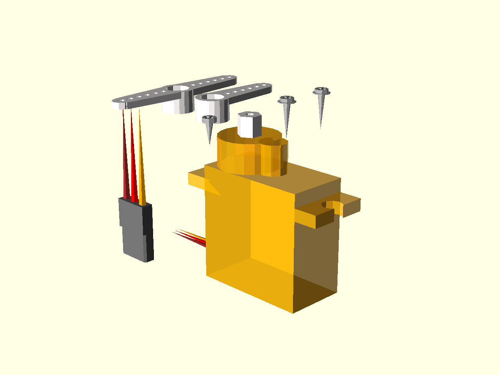
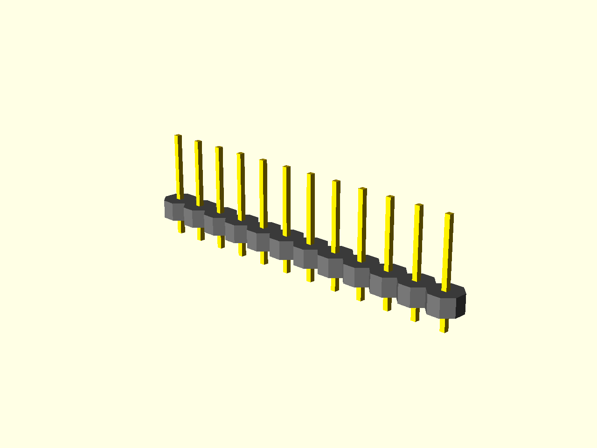

Bill of Materials
*****************

With the exception of the printed circuit board, which you have to make or
order according to the provided designs, all parts are off-the-shelf, ready
to use components which you can find in hobby stores, or even better, order
online.

Required
========
   * Printed Circuit Board, the board design file is in the repository,
   * Arduino Pro Mini, 3.3V/8Mhz version,
   * 12 SG90 Micro Servos, with screws and plastic horns,
   * 2.54mm pin headers, with at least 38 pins total,
   * 3.7V 1S LiPo Battery (I used a 300mAh battery),

Optional
========
   * Infra-Red Receiver (I used VS1838B).
   * Ultra Sound distance sensor (I used HC-SR04),
   * 1000µF electrolytic capacitor, for avoiding brown-outs,
   * 2 47kΩ SMD resistors and a 47nF SMD capacitor, for battery monitoring,
   * Power Switch, for convenient on/off without unplugging the battery,
   * Piezoelectric Buzzer, for making noises,
   * Battery Charger Module, for charging the battery without unplugging,
   * Small Rubber Hose, for the feet,
   * Any additional sensors or boards you require.

At the time of writing, the required materials could be bought online for about
$50 total, but it greatly depends on availability, amount, and quality you
require. Also, consider the shipping time, especially for the parts ordered
overseas.

Printed Circuit Board
=====================

This is the only custom-made part of the robot. It's used to connect all the
parts electrically and hold them together mechanically. The design files for
the board are available in the repository_ in form of files for the Fritzing_
program. You can use that program to open the files, optionally make any
changes you want, and export them to whatever format you require. Then you can
send your designs to a prototype board fabrication service and have them
created for you. There are two versions of the board, single-layer ``pcb.fzz``
and double-layer ``pcb2.fzz``. The double-layer one is preferred.

If you don't have an access to a prototype board fabrication service, or don't
want to use it, you can also create the board yourself, or even use a
perma-board and make the connections with pieces of wire. This is not covered
in this instruction, however.

.. _repository: https://bitbucket.org/thesheep/tote
.. _Fritzing: http://fritzing.org

Arduino Pro Mini
================

The Arduino Pro Mini, or any of the widely available Pro Mini clones, are the
cheapest Arduino boards available, even as cheap as $2 a piece. That price is
achieved by stripping them of anything that isn't necessary -- including the
USB port. You cannot connect this board directly to your computer for
programming, as you can other Arduinos, instead you have to use a device called
``USB2TTL``. But you only need one such device, and you can re-use it for
programming as many Pro Minis, as you want.

You can also use a different small Arduino board, such as Nano or Pro Micro.
They do have an USB port on them, which will stick a little bit out from the
back of the robot.

It's very important that you use a 3.3V version of the board. There are two
versions, 5V and 3.3V, which differ in what voltage they expect. If you get the
5V version, it won't run on the single LiPo battery that we are using here.

The Pro Mini usually comes with three unsoldered pin headers, as you can see
here:

You will need to solder at least the short, 6-pin one (it may be a little
different version, with pins angled at 90°, but it doesn't matter much).
Remember to make it stick out at the top of the board, on the same side as all
the components, and leave the empty side of the board flat. Those are the pins
that you will use to program and debug your robot.

If you want to use sockets, you can also solder the two longer pin headers --
those come on the bottom of the board, on the empty side. If you don't want the
board to be removable from your robot, you can skip those and use them for the
servo sockets instead.

SG90 Micro Servos
=================

Those micro servomechanisms are commonly used in radio-controlled toys and
models, which makes them easily available and cheap. We will need 12 of them,
so the price is really important here. The specific SG90 model was chosen
because it's the cheapest currently available. You can replace it with any
other nine gram servomechanism instead.

Each servo comes with a set of plastic horns (single, double and cross-shaped),
as well with three screws (one small and two larger). We will need those to
build our robot's legs. This way you don't need any additional mechanical
parts.

Be careful when you are moving the servos by hand, they are not designed for
that and it's very easy to break one of the plastic gears inside them doing
that. Such a "stripped" servo is useless for our needs and has to be replaced.

Pin Headers
===========

Those are the same as the ones you get with the Pro Mini. In fact, if you are
not using sockets, you can use them. But that's only 24 pins, and you will need
a total of 38 pins, so you need to get more. You can buy them easily at any
electronics parts shop. Don't worry about their exact lengths, you will break
them into the lengths that you need.

1S LiPo Battery
===============

Your robot will need some kind of power source. We can't use regular batteries
(alkaline or rechargeable), because they are way too heavy for our robot.
Remember, that the robot has to be able to carry its own weight on those legs.
That's why we will use a much lighter LiPo battery. You should be able to buy
one easily in an electronics parts shop, a hobby remote-control models shop, or
you can even use an battery from an old cellphone. Just make sure it's small
and light and has only one cell, that is, has voltage of 3.7V.

Be careful when handling such batteries. Unlike the regular alkaline batteries,
they are very sensitive to mishandling. Damaging them mechanically,
overcharging or even short-circuiting them can make them explode and release
toxic chemicals.
