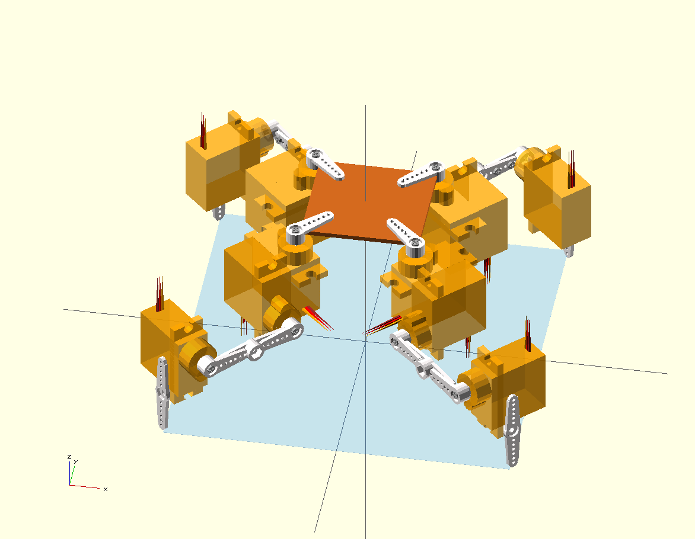
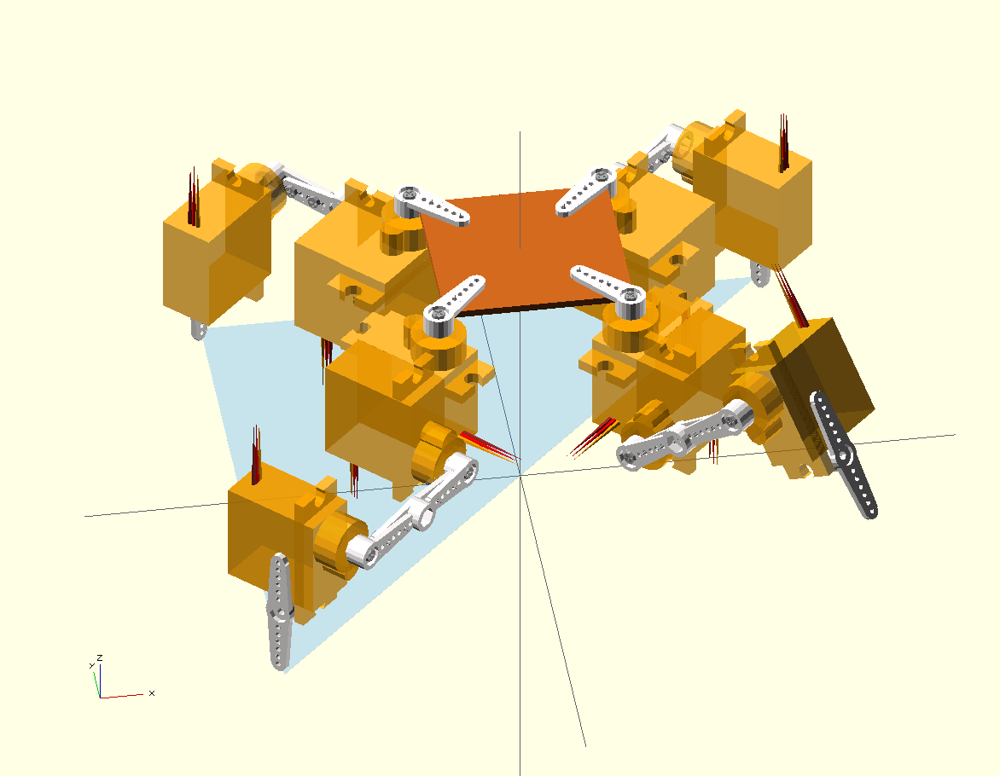
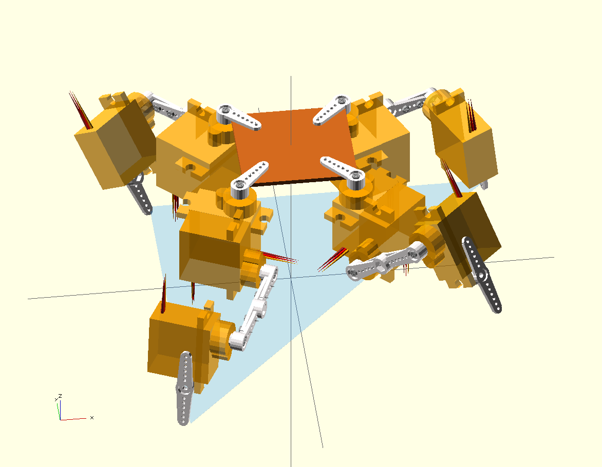
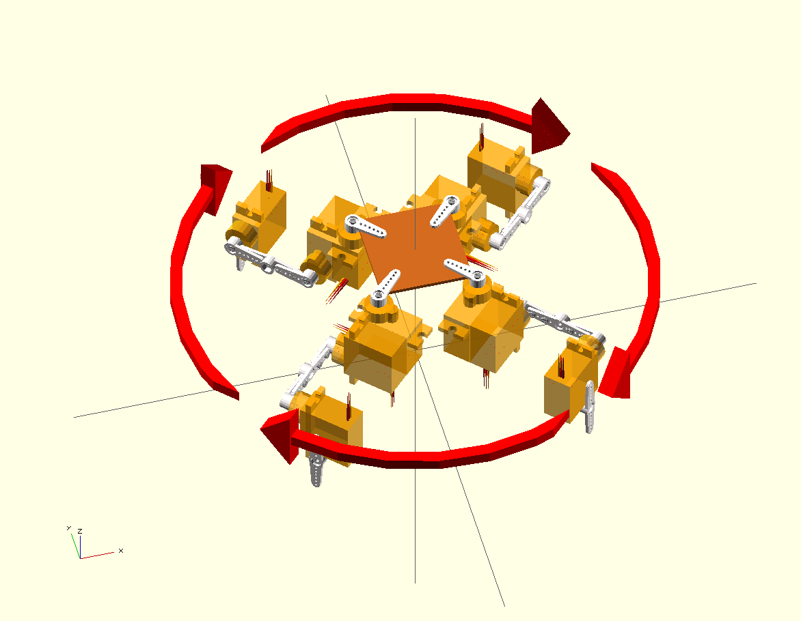

Walking Algorithms
******************

The way in which an animal or a robot walk is called a gait -- it tells us
how and in what order the legs are moved, how the body is balanced and how
it moves forward.

Statically and Dynamically Stable Gaits
=======================================

When the robot walks, it has to keep its balance. There are two general
strategies for doing that, and according to them, we divide the gaits into
statically stable and dynamically stable.

For statically stable gaits it doesn't matter how fast they are performed, or
whether the robot is stopped in a middle of a step -- it is stable at any
moment, at all times. Animals and people use those gaits when they want to go
slowly, or when they want to be able to stop at any time. An example of such a
gait is the "creep" gait, used by cats stalking their prey.

Dynamically stable gaits are much harder, as they have to be performed at a
particular speed and cannot be interrupted at an arbitrary point. They are
sometimes called "controlled falling", as they exploit the fact that it takes
some time for the robot to fall when it's unstable, and that time can be used
to move the legs in such a way as to prevent the fall. Most animal gaits are
dynamically stable, as they tend to be faster and more energy-efficient. An
example of a simple dynamically stable gait is the "trot" gait.

Area of Support
===============

I order for a relatively light robot, like ours, to be statically stable, it
has to keep its center of mass somewhere between its legs. More precisely, if
you connect all the feet on the ground with straight lines, so that they form a
convex polygon, the center of mass has to be located directly over it. We call
that polygon the "area of support" of the robot at the given moment. The area
of support will change depending on which legs are placed on the ground and
where, so the robot will sometimes need to shift its center of mass around to
remain stable while changing its stance.

The image below shows the are of support of our robot in the starting position:

In a heavier robot, you also have to take into account the inertia, so that
it's not sufficient to just track the center of mass -- you have to track the
so-called "zero-moment point", often abbreviated ZMP, which is basically the
point on the ground directly below the center of mass, shifted to account for
the inertia. We will not get into details of that here, as our robot is light
enough that just leaving some small margin around the area of support is
enough.

Raising a Leg
-------------

When the robot raises one of the legs, its area of support changes dramatically:

You can see, that our center of mass is directly on an edge of our area of support. That's bad, because the smallest force can now tip our robot and make it fall. We can avoid that by moving all the legs toward the one leg that we want to raise before raising it, so that the center of mass shifts:

There are also other methods of balancing, not covered here. For example, many
animals have a flexible spine, that they can bend sideways to shift their
center of mass. Other animals have tails that they use to balance.
Possibilities are endless.

Moving Forward
==============

Our goal is to propel our robot horizontally across the floor. The simplest
solution to do that, at least initially, is to just move all the legs that are
touching the ground backwards. If we do it slow enough, so that they don't
slip, they will stay where they were, but move the body of the robot forward.
This is an excellent way of moving around, and many industrial robots do it
this way, bolted to the floor in one place. There is however a small problem:
the range is quite limited. Sooner or later you will either move your center of
mass outside the support area, or your legs move to their maximum range. What
then?

Then you raise the legs from the ground, move them forward, and set them down
in the new place. But you have to be smart about it, because if you do it with
all the legs at once, you will fall down. But you can raise a single leg and
still stand on the remaining three. You can also raise and move that leg
*while* moving the remaining legs backwards, which saves you some time and
makes it both faster and more smooth.

Now, as you know, if you are raising a leg, you also have to make sure that the
center of mass stays inside the support area. To do that, you will have to
shift the robot's body away from the leg that you are rising. Since you are
shifting your body forwards, it is also important in which order you raise the
legs -- some orders will be more stable than others.

So, to sum, our plan of action is:
  * move all the legs that are on the ground backwards,
  * for each leg in a set order:

    + shift the body away from that leg
    + raise the leg
    + move the leg forward
    + set the leg on the ground.

The Creep Gait
==============

What order is the best for making steps, if you raise one leg at a time? There
are six possible combinations (assuming you always start with the same leg).
But it turns out that only one of those possible orders actually gives good
stability, and incidentally, it's the same order as all the animals use: the
creep gait:

Note that this order is best only when you are moving forward. If you are
moving sideways, backwards or rotating, then other leg orders are optimal.
That's why it probably makes sense to adapt the order to the situation.

The Trot Gait
=============

The creep gait is stable, but quite slow -- raising only one leg at a time, you
can't move the remaining legs backwards too fast, or you move out of the range
of your legs. In addition, shifting the robot's body before each step also
takes some time. Is there a faster way?

Turns out that you can move two opposite legs at the same time, if only you do
it fast enough, so that the robot will not have time to tip on the two
remaining legs. This is not a statically stable gait -- you can only stop
safely between steps, when all the legs are on the ground, but it's more than
twice as fast as the creep gait: first, you move two legs at a time, and
second, you don't have to shift your body for balance.
