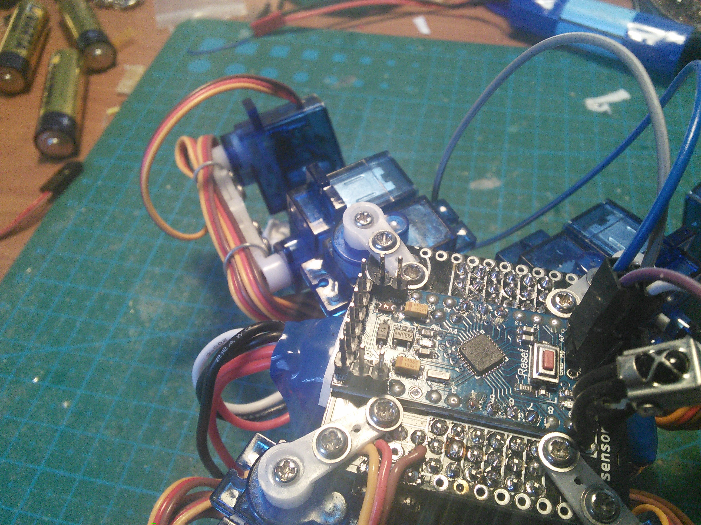
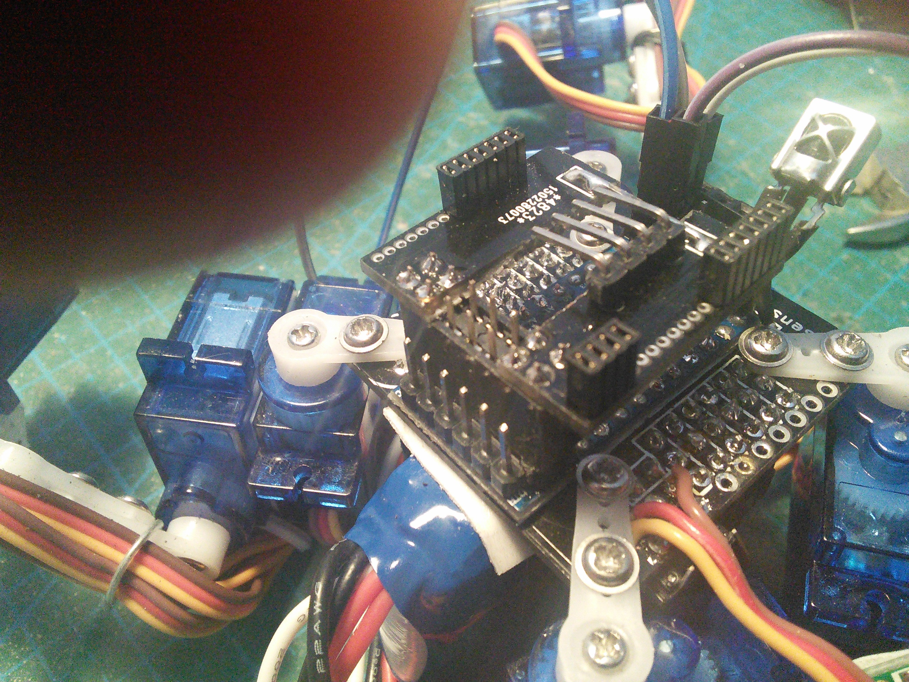
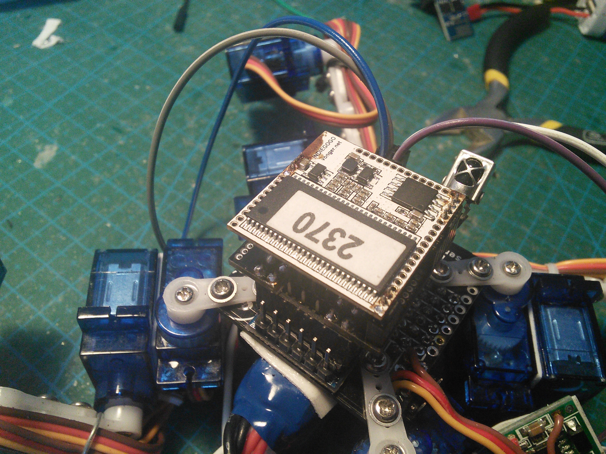

Modifying and Extending
***********************

Since this robot is so simple, it is very easy to modify or extend it. You can
add sensors and peripherals, or control it remotely from another computer or
directly with another microcontroller or microcomputer board.

GPIO Pins
---------

Most of the Arduino's pins are used internally, but there are several of them
left for your use:

  * 7 pins can be used as digital,

    - 1 of them has a LED on it,
    - 2 of them can be used as serial interface,
    - 2 of them can trigger interrupts,

      + 1 of them has PWM,

    - 2 other can be also used as analog pins,

      + they can also be used as I²C interface,

  * 2 analog-only pins.

Sensors
-------

You can connect anything that runs on 3.3V and can be connected either to the
free GPIO pins, or to additional board or multiplexer that you add. Examples
include:

  * ultrasonic distance sensor, such as HC-SR04,
  * switches at the ends of the feet,
  * accelerometer, gyroscope and/or compass,
  * encoders for leg positions,
  * light sensors, for following light,

Peripherals
-----------

You can also use the GPIOs to attach additional hardware that would do
something. Unfortunately, you cannot easily add more servos, as the Arduino
Servo library being used only supports 12 of them at once. But instead you
can add:

  * piezoelectric buzzer, for beeping,
  * addressable LEDs, for light effects,
  * infrared diode, for "shooting" at other robots in a laser-tag game,
  * a nerf gun,
  * a LiPo battery charger.

Remote Control
--------------

You can use the serial interface to connect a transmitter/receiver module and
make the robot communicate with another device. For example, you can use:

  * WiFi module, such as ESP8266,
  * Bluetooth module, such as HC-05,
  * Radio module, such as NRF24,
  * BLE module,
  * and so on.

Additional Boards
-----------------

You can also add another microcontroller or microcomputer board to the robot,
and make it communicate with it either through the serial or I²C pins. Some
examples include:

  * Arduino Pro Mini, with more pins,
  * VoCore, a computer running OpenWRT Linux,
  * PyBoard, a microcontroller runnning MicroPython,
  * Teensy 3.1, an ARM-based microcontroller board,
  * OpenMV, a microcomputer with a camera, programmable with Python,
  * ESP8266 with NodeMCU firmware, programmable in Lua.

The possibilities are infinite, as long as the board in question has a serial
or I²C interface, can be powered from a single LiPo battery, and doesn't weight
too much for the robot to carry it.

If your board or module can be powered with 3.3V, simply use the FTDI header of
your Pro Mini for connecting it -- it has broken out the power and serial
interface. You will have to write the code for communicating with the board
yourself.

If the board requires 5V or considerable amounts of current, you don't want to
power it from Pro Mini's power regulator. Instead, add pins to the RAW and GND
pads on it, and to the RX and TX pads:

Then use a double-row female header to connect your breakout board to the Pro
Mini:

And connect your board on top of that:

Of course, you will need to use a power source that can power your board.
