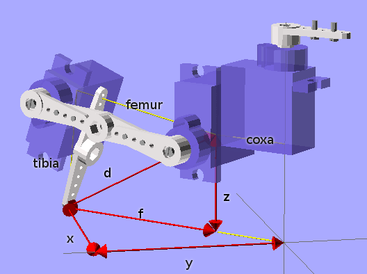

Inverse Kinematics
******************

Kinematics is the process of determining how a robot will move given certain
inputs. Inverse kinematics is for determining what inputs we need to give it to
get into a certain position. In particular, leg inverse kinematics for walking
robots is the process of calculating the angles for all the joints required to
get the tip of the leg in a certain position relative to the body. There is
also body inverse kinematics, which tells us in what positions the legs have to
be for the body to be in a certain position (tilt, yaw, rotation, shift).

This are notes for determining the inverse kinematics for a four-legged robot
with three degrees of freedom per leg. Let's start with an image of the leg:

Basic Trigonometry
==================

For a start, need to determine the geometry of the leg and describe it using
mathematical formulas. For that, we will start with a few tricks from the
elementary school.

To calculate the diagonal of a rectangle, we can use the Pitagoras theorem,
:math:`c^2=a^2+b^2`, so :math:`c = \sqrt{a^2+b^2}`.

To calculate one of the angles of a triangle for which we have the lengths of
all sides, we can use the Law of Cosines: :math:`c^2 = a^2 + b^2 -
2ab\cos{\alpha}`, which gives us :math:`\alpha = \arccos{a^2 + b^2 - c^2 \over
2ab}`.

Finally, to calculate the angle of the diagonal in a rectangle, we have :math:`\beta
= \arctan{{y\over x}}``, or better, ``beta = atan2(y, x)``, as most languages
have a convenience function for this that also handles the sign properly.

Solving a Leg
=============

We are given the coordinates :math:`(x, y, z)` and we want to calculate the
angles :math:`(\alpha, \beta, \gamma)` of the hip, knee and ankle joints. We
also have the lengths of coxa (:math:`L_c`), femur (:math:`L_f`) and tibia
(:math:`L_t`).  The hip is easy:

.. math::
    \alpha = \mathrm{atan2}(y, x)

All the rest is happening in one vertical surface along the hip angle, so we
can convert our :math:`(x, y, z)` into :math:`(f, z)`, where :math:`f =
\sqrt{x^2 + y^2} - L_c` is the part of the diagonal starting at the knee joint
(see picture).

The knee angle is going to consist of two parts. The first is easy,
:math:`\beta_1 = \mathrm{atan2}(z, f)`. For the second, we need to know the
lenght of the diagonal :math:`d = \sqrt{f^2 + x^2}`. Once we have :math:`d`, we
can solve the triangle formed by tibia and femur, and we get :math:`\beta_2 =
\arccos{L_f^2 + d^2 - L_t^2 \over 2L_fd}`. Finally:

.. math::
    \beta = \beta_1 + \beta_2

Solving the same triangle, but for a different angle, will give us our ankle
angle:

.. math::
    \gamma = \arccos{L_f^2 + L_t^2 - d^2 \over 2L_fL_t}

Trim and Reverse
================

We have the angles, but they are unlikely to have to align with where our
physical servomotors have their zero angles, and the direction they turn. So we
have to add some offsets to them, and possibly reverse them. The easiest way to
go about that is to set all your servos to 0 and check where the end of the leg
should be then. Then run those coordinates through our formulas, and you will
get the numbers that you have to subtract from our calculated angles (so that
at the initial position they are all zero). Then move them a little from the
initial position and see if the directions are right.
