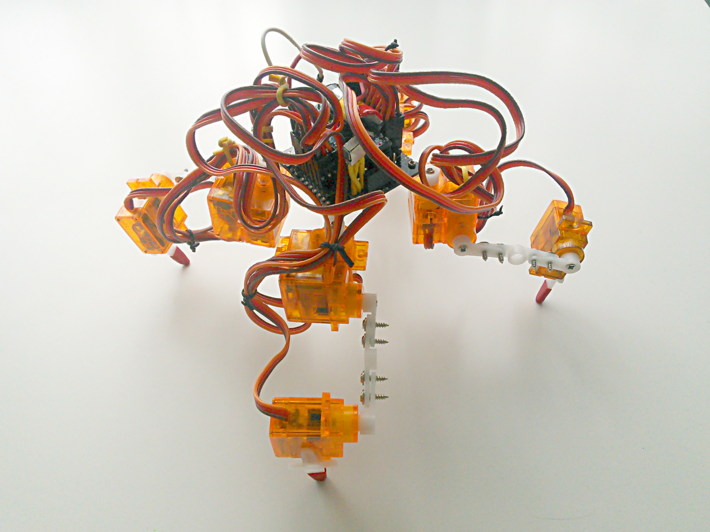

Introduction
************

What is Tote?
=============

It's a small walking robot, designed to be as cheap and simple to build as
possible, while at the same time serving as a starting point for more complex
projects and for teaching. In its basic form it just walks around and turns,
controlled by a TV remote, but it can be easily extended by adding sensors and
more interesting behaviors.

How is it different from all those toys?
========================================

Most walking toys available currently are not very different from the wind-up
toys that our parents used to play with -- except they have an electric motor
instead of a spring. But the whole walking pattern is hard-wired in the
mechanism of the toy, and it can do nothing more than walking forward and
backwards on flat surfaces, and maybe turning.

This robot is potentially more than a toy. While the basic functionality that
you begin with is pretty much the same, this robot can move each of the legs
individually within three degrees of freedom, controlled with a computer
program that you can freely modify. You can make it dance, you can make it
climb, you can make it follow any movement plan. Furthermore, you can add
sensors and modules to it, that would allow you to make it do practically
anything -- as long as you have enough skill to actually program it. Don't get
me wrong, it's very hard to make it do even the simplest things -- but the
point is that you can!

Challenges
==========

A lot of walking robot projects never get very far, because they turn out to be
much more complex, expensive and fragile than initially anticipated. By making
certain choices about size, materials and software, I managed to keep Tote
relatively simple, affordable and robust. Thanks to its small size it has more
than enough power to carry its weight, and the simple plastic parts are enough
to hold it together and even survive falls from heights with just minor damage.
At the same time, being just a starting point, Tote gives you a lot of room for
improvement and experimenting.

Required Skills
===============

First and foremost, you will need patience. A lot of decisions were made here
trading time for money. You will wait for the printed circuit board to be made
for you in a factory and then shipped to you. You will wait for shipment of all
the parts you order online. Once it all arrives, you will spend hours debugging
and fine-tuning the code. So this is not a project for aggressive deadlines.

You will also need to glue things together and assemble them using screws. You
will probably also need to use a file to adjust parts that don't quite fit. You
won't need a mechanical saw or drill, though (assuming you use a PCB they made
for you in a factory -- if you are hardcore, you can make the PCB yourself).

This project requires some basic soldering -- at the level of soldering pin
headers to a module, or soldering wires to a PCB. Be careful not to burn
yourself.

You will have to properly connect the USB2TTL converter to your robot to
program it from your computer using the Arduino IDE. For basics you don't need
to know how to code, as all the code is written for you, but you will probably
want to modify and extend it once you get it to work.

Depending on how proficient you are in such things, it can take you anywhere
from four to eight hours to get it all working.

In order to take the project further, you will need at least basic knowledge of
Arduino programming and information about how the sensors that you want to use
work, and how to manipulate the data that you receive from them. If you add
more modules, you will also need to know how to program those. This is a huge
topic, and you can keep learning and experimenting for years.
